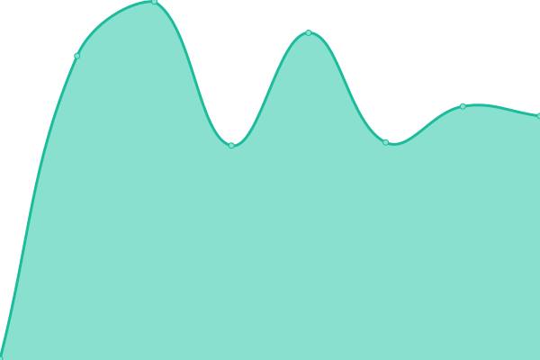

# [📈 Live Status](https://status.xend.tools): <!--live status--> **🟩 All systems operational**

This repository contains the open-source uptime monitor and status page for [Franklin](https://frank.bluebecks.com), powered by [Upptime](https://github.com/upptime/upptime).

With [Upptime](https://upptime.js.org), you can get your own unlimited and free uptime monitor and status page, powered entirely by a GitHub repository. We use [Issues](https://github.com/franko4don/status/issues) as incident reports, [Actions](https://github.com/franko4don/status/actions) as uptime monitors, and [Pages](https://status.xend.tools) for the status page.

<!--start: status pages-->
<!-- This summary is generated by Upptime (https://github.com/upptime/upptime) -->
<!-- Do not edit this manually, your changes will be overwritten -->
<!-- prettier-ignore -->
| URL | Status | History | Response Time | Uptime |
| --- | ------ | ------- | ------------- | ------ |
|  [Wicrypt Api](https://api.wicrypt.com/api/v2/healthCheck/liveness) | 🟩 Up | [wicrypt-api.yml](https://github.com/franko4don/status/commits/HEAD/history/wicrypt-api.yml) | 

 433ms
     
 | 

<a href="https://status.xend.tools/history/wicrypt-api">100.00%</a>
    

<!--end: status pages-->

[**Visit our status website →**](https://status.xend.tools)

## 📄 License

- Powered by: [Upptime](https://github.com/upptime/upptime)
- Code: [MIT](./LICENSE) © [Franklin](https://frank.bluebecks.com)
- Data in the `./history` directory: [Open Database License](https://opendatacommons.org/licenses/odbl/1-0/)
